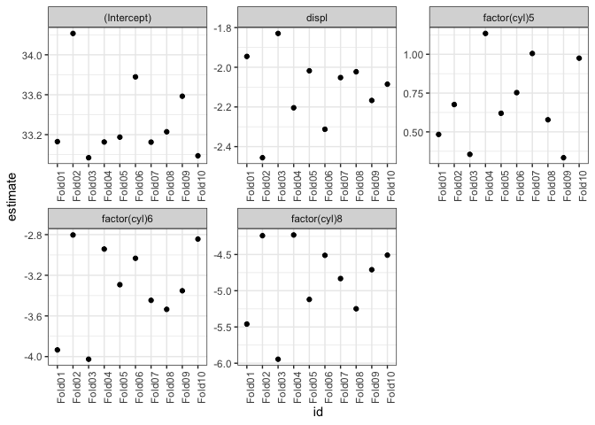

CV Analysis of mpg data
================
Ian Handel
2019-02-05

``` r
library(tidyverse)
```

    ## ── Attaching packages ──────────────────────── tidyverse 1.2.1 ──

    ## ✔ ggplot2 3.1.0           ✔ purrr   0.2.5      
    ## ✔ tibble  2.0.99.9000     ✔ dplyr   0.7.8      
    ## ✔ tidyr   0.8.2           ✔ stringr 1.3.1      
    ## ✔ readr   1.3.1           ✔ forcats 0.3.0

    ## ── Conflicts ─────────────────────────── tidyverse_conflicts() ──
    ## ✖ dplyr::filter() masks stats::filter()
    ## ✖ dplyr::lag()    masks stats::lag()

``` r
library(here)
```

    ## here() starts at /Users/ihandel/Documents/EDINBURGH/projects/make_rsample_purrr

``` r
library(rsample)
```

    ## Warning: package 'rsample' was built under R version 3.5.2

``` r
library(yardstick)
```

    ## For binary classification, the first factor level is assumed to be the event.
    ## Set the global option `yardstick.event_first` to `FALSE` to change this.

    ## 
    ## Attaching package: 'yardstick'

    ## The following object is masked from 'package:readr':
    ## 
    ##     spec

``` r
library(broom)
library(fs)
```

### create output director if not there

``` r
fs::dir_create(here("output"))
```

### Load clean data

``` r
dat <- read_csv(here("data", "clean", "mpg_data_clean.csv"))
```

    ## Parsed with column specification:
    ## cols(
    ##   manufacturer = col_character(),
    ##   model = col_character(),
    ##   displ = col_double(),
    ##   year = col_double(),
    ##   cyl = col_double(),
    ##   trans = col_character(),
    ##   drv = col_character(),
    ##   cty = col_double(),
    ##   hwy = col_double(),
    ##   fl = col_character(),
    ##   class = col_character()
    ## )

### Resample

``` r
cv <- dat %>%
  rsample::vfold_cv(v = 10)

print(cv)
```

    ## #  10-fold cross-validation 
    ## # A tibble: 10 x 2
    ##    splits           id    
    ##    <list>           <chr> 
    ##  1 <split [210/24]> Fold01
    ##  2 <split [210/24]> Fold02
    ##  3 <split [210/24]> Fold03
    ##  4 <split [210/24]> Fold04
    ##  5 <split [211/23]> Fold05
    ##  6 <split [211/23]> Fold06
    ##  7 <split [211/23]> Fold07
    ##  8 <split [211/23]> Fold08
    ##  9 <split [211/23]> Fold09
    ## 10 <split [211/23]> Fold10

### Fit lm of hwy mpg on displacement and cylinder number

``` r
cv <- cv %>%
  mutate(model = map(splits, ~ lm(hwy ~ factor(cyl) + displ,
    data = as_tibble(.x)
  ))) %>%
  mutate(fit = map(model, tidy))

print(cv)
```

    ## #  10-fold cross-validation 
    ## # A tibble: 10 x 4
    ##    splits           id     model    fit             
    ##  * <list>           <chr>  <list>   <list>          
    ##  1 <split [210/24]> Fold01 <S3: lm> <tibble [5 × 5]>
    ##  2 <split [210/24]> Fold02 <S3: lm> <tibble [5 × 5]>
    ##  3 <split [210/24]> Fold03 <S3: lm> <tibble [5 × 5]>
    ##  4 <split [210/24]> Fold04 <S3: lm> <tibble [5 × 5]>
    ##  5 <split [211/23]> Fold05 <S3: lm> <tibble [5 × 5]>
    ##  6 <split [211/23]> Fold06 <S3: lm> <tibble [5 × 5]>
    ##  7 <split [211/23]> Fold07 <S3: lm> <tibble [5 × 5]>
    ##  8 <split [211/23]> Fold08 <S3: lm> <tibble [5 × 5]>
    ##  9 <split [211/23]> Fold09 <S3: lm> <tibble [5 × 5]>
    ## 10 <split [211/23]> Fold10 <S3: lm> <tibble [5 × 5]>

### predict on withheld data

``` r
cv <- cv %>%
  mutate(predict = map2(
    splits,
    model, ~ tibble(
      predict = predict(.y, as_tibble(.x)[-.x$in_id, ]),
      actual = as_tibble(.x)[-.x$in_id, ]$hwy
    )
  ))

print(cv)
```

    ## #  10-fold cross-validation 
    ## # A tibble: 10 x 5
    ##    splits           id     model    fit              predict          
    ##  * <list>           <chr>  <list>   <list>           <list>           
    ##  1 <split [210/24]> Fold01 <S3: lm> <tibble [5 × 5]> <tibble [24 × 2]>
    ##  2 <split [210/24]> Fold02 <S3: lm> <tibble [5 × 5]> <tibble [22 × 2]>
    ##  3 <split [210/24]> Fold03 <S3: lm> <tibble [5 × 5]> <tibble [23 × 2]>
    ##  4 <split [210/24]> Fold04 <S3: lm> <tibble [5 × 5]> <tibble [20 × 2]>
    ##  5 <split [211/23]> Fold05 <S3: lm> <tibble [5 × 5]> <tibble [21 × 2]>
    ##  6 <split [211/23]> Fold06 <S3: lm> <tibble [5 × 5]> <tibble [20 × 2]>
    ##  7 <split [211/23]> Fold07 <S3: lm> <tibble [5 × 5]> <tibble [20 × 2]>
    ##  8 <split [211/23]> Fold08 <S3: lm> <tibble [5 × 5]> <tibble [21 × 2]>
    ##  9 <split [211/23]> Fold09 <S3: lm> <tibble [5 × 5]> <tibble [18 × 2]>
    ## 10 <split [211/23]> Fold10 <S3: lm> <tibble [5 × 5]> <tibble [21 × 2]>

### Add rmse

``` r
cv <- cv %>%
  mutate(rmse = map(predict, ~ rmse(.x, actual, predict))) %>%
  unnest(rmse)
```

### Plot fits

``` r
cv %>%
  unnest(fit) %>%
  ggplot() +
  aes(x = id, y = estimate) +
  geom_point() +
  facet_wrap(~term, scale = "free") +
  theme_bw() +
  theme(axis.text.x = element_text(angle = 90))
```



``` r
ggsave(here("output", "figure_1.pdf"), height = 6, width = 5)
```

### Report RMSE

``` r
cv %>%
  summarise(
    mean_rmse = mean(.estimate),
    min_rmse = min(.estimate),
    max_rmse = max(.estimate)
  )
```

    ## # A tibble: 1 x 3
    ##   mean_rmse min_rmse max_rmse
    ##       <dbl>    <dbl>    <dbl>
    ## 1      3.67     2.47     4.61
